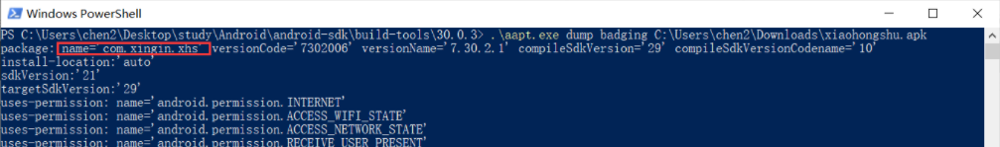
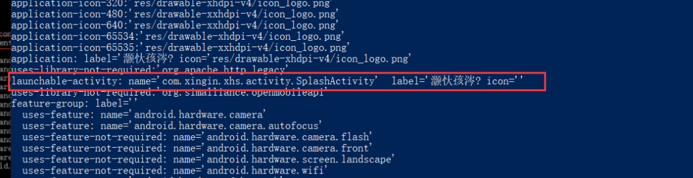
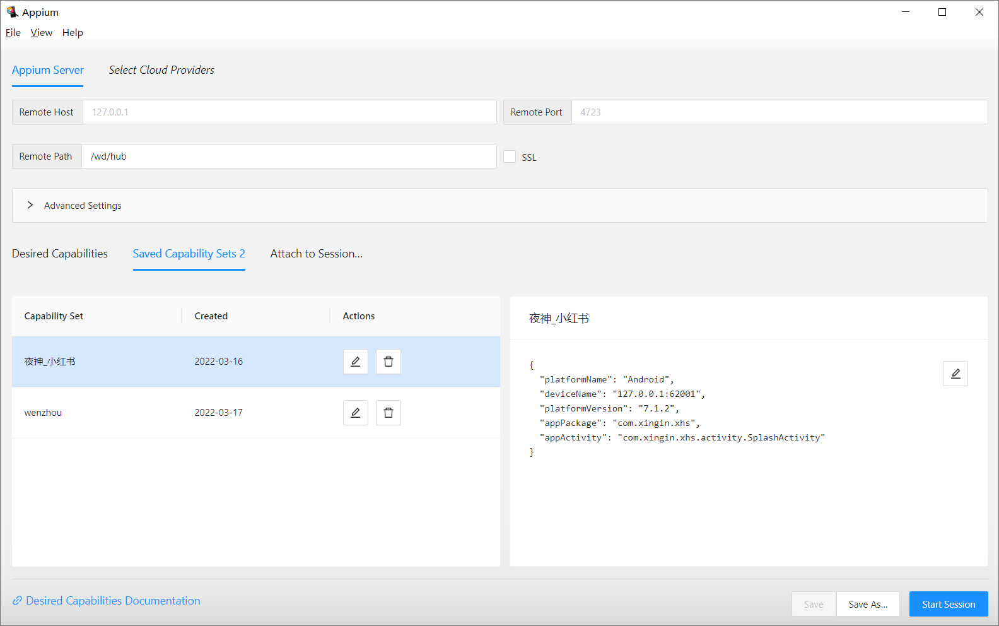
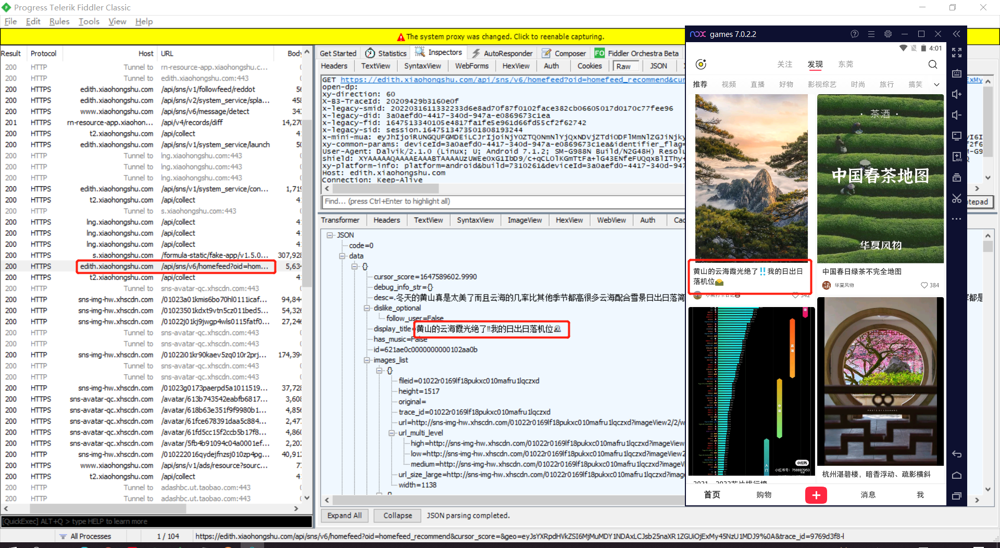
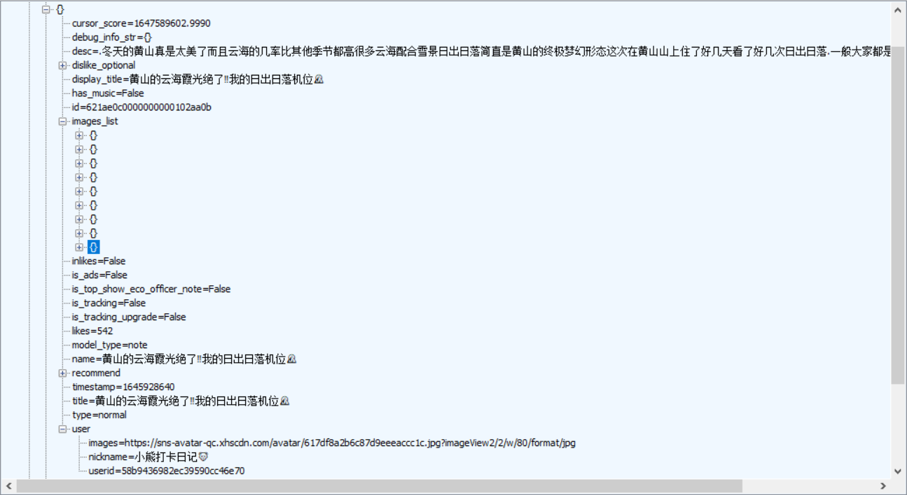
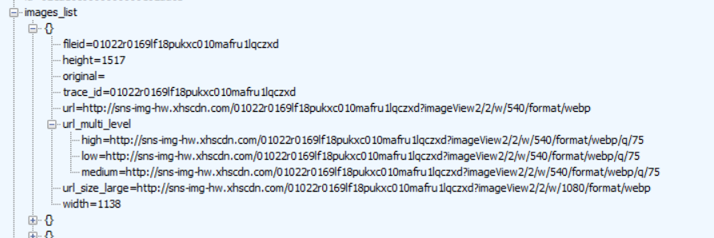
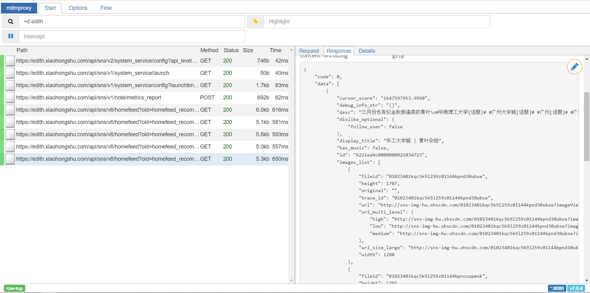

# 小红书爬取

## 设想方案：

通过抓包，直接找到相应的链接，然后通过scrapy得到图片或者直接通过appium获得对应的图片

1. ### charles

   失败，进入app就报错，说网络错误

2. ### fidder

   失败，同上

   问题所在：

   

   解决方法：

    通过root权限，将证书放入系统认可处，推荐在模拟器中使用

   具体教程：[把 charles，Fiddler 证书安装到安卓根目录，解决安卓微信 7.0 版本以后安装证书也无法抓包问题，需要 root - 宠你的鑫 - 博客园 (cnblogs.com)](https://www.cnblogs.com/chongnidexin/p/14606428.html)

3. appium（appium desktop+appium inspector 因为不知道什么时候分家了，所以这里也卡了一下）

   刚开始使用夜神模拟器，使用模拟器自带的浏览器下载小红书安装包的时候会安装失败，不知道为啥，可能是小红书安装包安装的时候会检测设备？？但是之后<u>使用自己电脑上的浏览器下载好安装包之后再拖到模拟器</u>进行安装又能够安装成功。。。

   于是开始后续操作

   查看包信息

   

   

   appium desktop直接start完事

   appium inspector进行相关配置

   

   配置：

   ```json
   {
     "platformName": "Android",
     "deviceName": "127.0.0.1:62001",
     "platformVersion": "7.1.2",
     "appPackage": "com.xingin.xhs",
     "appActivity": "com.xingin.xhs.activity.SplashActivity"
   }
   ```

   然后start session，之后就是脚本录制了

   问题：

   1.使用账号密码登录时会提示“登陆异常，请选择验证码登录”--------->使用py程序跑的时候又可以正常跑了。。。。很奇怪

   2.登陆成功之后加载主页面时提示：

   使用sppium爬取，，，因为每次模拟登录都是用账号，所以没几次就被检测出来了。。。

   3.多次重复登录也会出现登陆异常提醒，十分不方便

   4.抓包得到的链接无法通过浏览器直接访问（我感觉是和请求链接中的trace_id、unread_begin_note_id、unread_end_note_id、unread_note_count这几个参数有关系，trance_id重大嫌疑！！！）

   所以采用后面的最终方案

## 最终实现方案

appium+mitmproxy+fiddler+夜神模拟器（各环境配置可在网上百度，文章最后附笔者配置所使用的文章地址）

思路：通过fiddler和夜神模拟器抓包分析，得到我们需要的图片url，然后通过mitmproxy来执行我们的python代码（重点！这才是大杀器！！！），实现对图片文件的保存（此处采用本地文件保存，也可采用数据库），

1. fiddler+夜神模拟器：开始前的准备——抓包分析

   

   从结果上可以看出，app通过向edith.xiaohongshu.com协参数发送请求得到了我们所需要的文章信息

   从response可以看出，data下data{}所包含的就是一篇文章的内容

   

   在一篇文章中包含了相关信息，其中就有我此次需要的图片（images_list中）

   

   images_list中包含每个图片的url等信息，通过这个url，我们就能够爬取这些图片了

   

2. mitmproxy——运行时爬取我们需要的东西

   

   ```python
   import json
   import time
   import requests
   
   
   def response(flow):
       refresh_url = 'https://edith.xiaohongshu.com/api/sns/v6/'
       if flow.request.url.startswith(refresh_url):
           for data in json.loads(flow.response.text)['data']:
               article = dict()
               # 标题
               article['title'] = data['display_title']
               # 描述
               article['desc'] = data['desc']
               # 图片列表
               images_list = data['images_list']
               # 具体图片url
               image_url = list()
               for image in images_list:
                   image_url.append(image['url_size_large'])
               # 保存到本地
               data = requests.get(image_url[0])
               file = open('./' + str(image_url[0]).split('/')[3].split('?')[0] + '.jpg', "wb")
               file.write(data.content)
               file.close()
               article['images'] = image_url
               article['time'] = time.strftime("%Y-%m-%d  %H:%M:%S", time.localtime(time.time()))
               print(article)
               print('-------------------')
           print(flow.response.text)
           print('++++++++++++++++++++++++++++++++++++++++++++++++')
           print(flow.request.url)
           print('=================================================')
   
   ```

3. appium——不断刷新页面

   ```python
   # coding=utf-8
   import time
   
   from appium import webdriver
   from PIL import Image
   
   desired_caps = {
       'platformName': 'Android',
       'deviceName': '127.0.0.1:62001',
       'platformVersion': '7.1.2',
       'appPackage': 'com.xingin.xhs',
       'appActivity': 'com.xingin.xhs.activity.SplashActivity'
   }
   
   driver = webdriver.Remote('http://127.0.0.1:4723/wd/hub', desired_caps)
   
   
   # 登录 TODO：账号密码登录报错，提示登陆异常，要验证码登录
   def login():
       time.sleep(3)
       # 开始同意按钮
       el1 = driver.find_element_by_id("com.xingin.xhs:id/ctf")
       el1.click()
       time.sleep(10)
       # 手机号码登录按钮
       el2 = driver.find_element_by_id("com.xingin.xhs:id/d07")
       el2.click()
       time.sleep(5)
       # 选择密码登录
       el5 = driver.find_element_by_id("com.xingin.xhs:id/d53")
       el5.click()
       time.sleep(5)
       # 输入账号
       el6 = driver.find_element_by_id("com.xingin.xhs:id/d0a")
       el6.send_keys("XXXX")
       time.sleep(5)
       # 输入密码
       el7 = driver.find_element_by_id("com.xingin.xhs:id/d12")
       el7.send_keys("XXXX")
       time.sleep(5)
       # 点击登录
       el8 = driver.find_element_by_id("com.xingin.xhs:id/d0c")
       el8.click()
       time.sleep(3)
       # 点击同意
       el7 = driver.find_element_by_id("com.xingin.xhs:id/cte")
       el7.click()
   
       
   # 获得机器屏幕大小x,y
   def getSize():
       x = driver.get_window_size()['width']
       y = driver.get_window_size()['height']
       return (x, y)
   
   
   # 屏幕向下滑动---->刷新
   def swipeDown(t):
       size = getSize()
       x1 = int(size[1] * 0.5)
       y1 = int(size[0] * 0.75)
       y2 = int(size[0] * 0.05)
       driver.swipe(x1, y1, x1, y2, t)
   
   
   def main():
       login()
       while True:
           swipeDown(500)
           time.sleep(5)
   
   
   if __name__ == '__main__':
       main()
   ```

## 相关链接：

1. [appium+夜神模拟器+python安卓app爬虫初体验 - 没有音乐就退化耳朵 - 博客园 (cnblogs.com)](https://www.cnblogs.com/zylq-blog/p/9224950.html)

2. [fiddler配置及使用教程 - silencio。 - 博客园 (cnblogs.com)](https://www.cnblogs.com/bubu99/p/14830269.html)

   我和他有点不一样，我是直接将证书导出，然后拖进手机，然后进行安装的

   

3. [把 charles，Fiddler 证书安装到安卓根目录，解决安卓微信 7.0 版本以后安装证书也无法抓包问题，需要 root - 宠你的鑫 - 博客园 (cnblogs.com)](https://www.cnblogs.com/chongnidexin/p/14606428.html)

4. [mitmproxy证书添加为手机系统证书【转载+缝合】_qq_52688128的博客-CSDN博客](https://blog.csdn.net/qq_52688128/article/details/123580320?spm=1001.2014.3001.5502)

